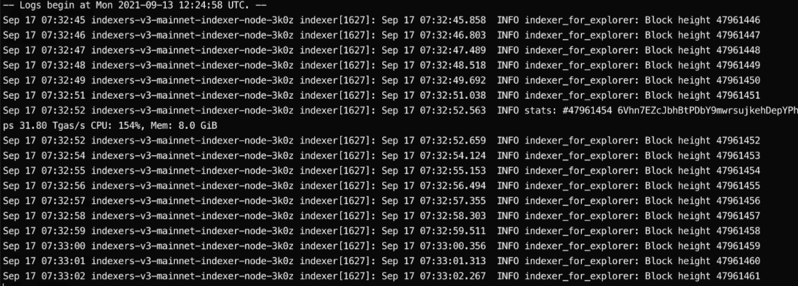

# Troubleshooting or NEAR Indexer for Explorer handbook

This document tries to describe how to handle known issues that may occur during the work process of NEAR Indexer for Explorer instance.

*It is assumed that the indexer instance is running with the `systemd` and the service is called `indexer`*

We use this `systemd` config:

```bash
[Unit]
Description=Indexer Service
StartLimitIntervalSec=500
StartLimitBurst=5

[Service]
User=ubuntu
Group=ubuntu
ExecStart=/home/ubuntu/indexer run --stream-while-syncing sync-from-interruption --delta 500
MemoryMax=90%
Restart=always
RestartSec=5s
EnvironmentFile=/home/ubuntu/.env
LimitAS=infinity
LimitRSS=infinity
LimitCORE=infinity
LimitNOFILE=65536

[Install]
WantedBy=multi-user.target
After=google-startup-scripts.service
```

---

In case of any issues, you need to check the node logs. Indexer is running as a `systemd` service, so you can check the logs with the command:

```bash
$ journalctl --follow --unit indexer
```

Normal logs look similar to the screenshot



During the normal working process indexer prints `INFO indexer_explorer: Block height N`

If it does not print anything or prints some debug structures instead of normal logs it probably means something went wrong. See Common issues section.


## Common issues

In case of any of the following issues, we stop the indexer `systemd` service to take manual control over indexer with the commands listed in the relevant sections below.

```bash
$ sudo service indexer stop
```

To handle any of the following issues, we’ll be running the indexer manually in a `tmux` on behalf of the `ubuntu` user.

```bash
$ sudo su ubuntu
$ cd ~
$ tmux
```

All of the following section assumes you’re running the command in `tmux`


### If it stuck

You need to record somewhere (a good place is https://github.com/near/near-indexer-for-explorer/issues) the block in which the indexer has stuck for further proper investigation.

Example of not fine indexer logs:


For now, we want to try to “skip” that block. In order to achieve this, we would run the indexer syncing process from the block height number following for the one where we have stuck.

If the stuck block height is 47961813

```bash
$ env RUST_LOG=”near=info” ./indexer run --stream-while-syncing sync-from-block --height 47961814 2>&1 | tee -a indexer.log
```

**Note** that this might be stuck as well, usually, nearest blocks have related data that can lead to getting stuck. So you might need to brute-force the block height to start syncing. Edit the above command by increasing the block height by 1 or by 10 until the indexer starts printing normal logs. If you cannot find that block in the nearest 100 blocks, see the next section.


### Non-strict-mode or If it stuck and we want to skip some blocks in order to continue properly

Similar to the case “If it stuck” and we want to skip the weird blocks in order to make the indexer work properly and investigate the root cause later.

You need to record somewhere (a good place is https://github.com/near/near-indexer-for-explorer/issues) the block in which the indexer has stuck for further proper investigation.

Example of not fine indexer logs:


For now, we want to try to “skip” that block. In order to achieve this, we would run the indexer syncing process from the block height number following for the one where we have stuck in non-strict-mode.

**A few words about non-strict-mode**

In this mode, the indexer will ignore some relations to keep working and not failing if it is unable to store because of missing relative data. This will skip `account_state_changes`, `access_keys` and will retry storing receipts at most 4 times.

We’re going to start from the stuck block and skip the next 100 (you can adjust it). After 100 blocks we will rerun the indexer in regular mode.

If the stuck block height is 47961813

```bash
$ env RUST_LOG=”near=info” ./indexer run --stream-while-syncing --non-strict-mode --stop-after-number-of-blocks 100 sync-from-block --height 47961813 2>&1 | tee -a indexer.log
```

Once 100 blocks are indexed in `non-strict-mode` the indexer will stop. We need to run it in regular mode and wait for indexer team to investigate the root cause.

```bash
$ env RUST_LOG=”near=info” ./indexer run --stream-while-syncing sync-from-interruption --delta 0 2>&1 | tee -a indexer-regular.log
```


### How to catch the tip of the network if it lagged

If the logs are normal but the latest printed block heights are delayed more than 30 minutes from the latest block height from the finality or the indexer was stuck for too long (see If it stuck section) we might need to catch up with the network.
Having at least two indexer nodes we need to run one of them in non-strict-mode from the latest block

```bash
$ env RUST_LOG=”near=info” ./indexer run --stream-while-syncing --non-strict-mode sync-from-latest 2>&1 | tee -a indexer.log
```

This will force the indexer to sync with the network ignoring some of the data completely. It’ll ignore `account_state_changes`, `access_keys` and might ignore some receipts.

On the other node, you need to perform actions from the “If it stuck” section


## Enabling verbose logs

NEAR Indexer for Explorer is configured to respect `RUST_LOG` environment variable. In order to enable or change the log level of any of the underlying module you can use it.

For example, to enable `info` level logs for the underlying `near` you can run the indexer like:

```bash
$ env RUST_LOG="near=info" ./indexer run ...
```

### `--verbose` equivalent from the nearcore

```bash
env RUST_LOG="cranelift_codegen=warn,cranelift_codegen=warn,h2=warn,trust_dns_resolver=warn,trust_dns_proto=warn,near=debug,indexer=debug,near_indexer_for_explorer=debug" ./indexer run ...
```
